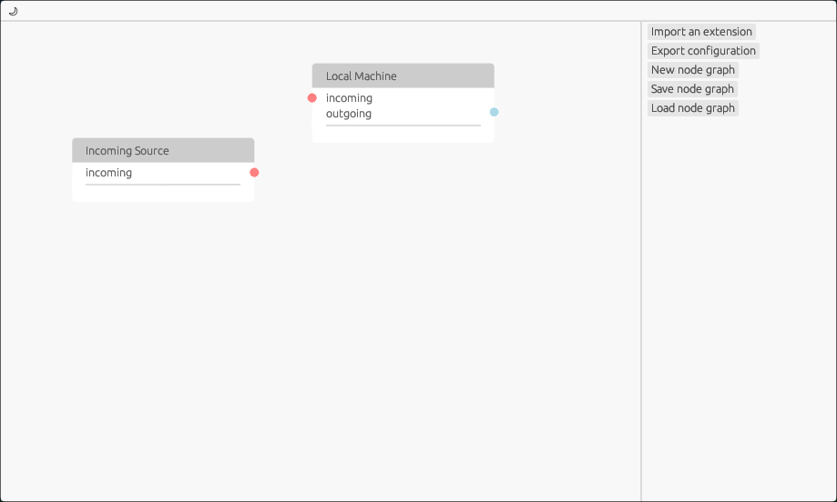
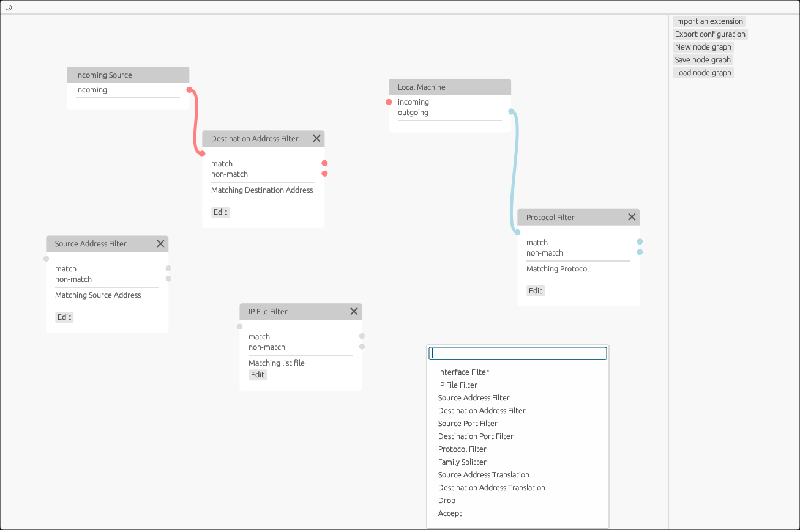

Extensible Linux networking configuration tool with utilising node graph architecture. 

# Usage
Node connections represent packet flow. Nodes split packet flow or apply actions to it.

Output ports can only have one connection. Input ports can have multiple.  Only nodes that can be reached from source are evaluated. Looping connections are broken automatically.

Upon launch/creation of a new node graph you will be presented with two permanent nodes: Source and Localhost. Source is where all incoming packets start from. Localhost is a local machine.

Use RMB to trigger a node selector. Search and click a node name to create a node at cursor. Move nodes by dragging them by header. Move groups of nodes by selecting them with mouse drag over an area and dragging one by the header.

Connect nodes by dragging a mouse cursor from port to port. If input port is dragged while output port is occupied, ongoing connection will not happen. If output port is dragged, it will disconnect.
Orange connections represent incoming packets, blue connections represent outgoing packets. Nodes with uncolored ports will obtain color upon connecting with a colored port.
Use `New Graph`, `Save`, and `Load` buttons to manage graphs. Click `Import Extension` to add extension to a current saved graph. Nodes from this extension will be available in the selector.
If node graph was saved with an imported extension, it will be loaded with an imported extension.
Click `Export configuration` to convert current saved graph to a set of executable and data files. Run `apply.sh` in exported config directory to apply the configuration.

# Building
Clone this repo and run `cargo build`
